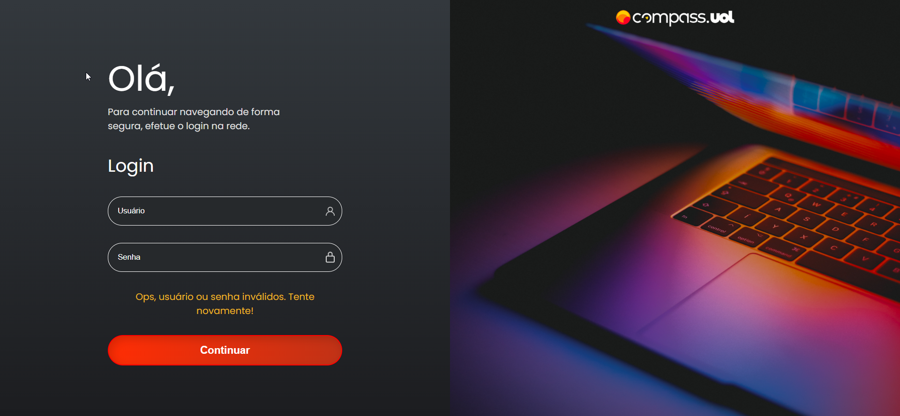

# Desafio Sprint 3 | Programa de Bolsas | Compass.UOL

- [Visão Geral](#visão-geral)
  - [Desafio](#desafio)
  - [Screenshots](#screenshot)
  - [Links](#links)
- [Processo](#processo)
  - [Construido com](#construido-com)
- [Login](#login)

## Visão Geral

### Desafio

Desenvolver uma tela de login, para acessar uma página "Home" com uma API de clima, pegando o clima e horário do local onde o usuário se encontra.<br/>
A página "Home" além da API de clima, também possue um timer que começa em 600 e vai decrescendo, e quando chega a 0 realoca o usuário para a página de usuário, também há um botão para o usuário deslogar e voltar a página de login e outro botão que reseta o time, fazendo-o voltar a 600.

### Screenshot
<div align="center">
    
    
    
</div>

### Links

- Solução: [Repositório GitHub](https://github.com/joaoatreto27/desafio-compass-3)
- Site: [Deploy](https://desafio-compass-3.netlify.app/#/login)

### Construido com

- HTML5
- CSS
- Flexbox
- Vue.JS
- Sass
- APIWeather


### Login

- Usuário: admin.admin
- Senha: 123456789

## Project setup
```
npm install
```

### Compiles and hot-reloads for development
```
npm run serve
```

### Compiles and minifies for production
```
npm run build
```

### Run your unit tests
```
npm run test:unit
```

### Run your end-to-end tests
```
npm run test:e2e
```

### Lints and fixes files
```
npm run lint
```

### Customize configuration
See [Configuration Reference](https://cli.vuejs.org/config/).
